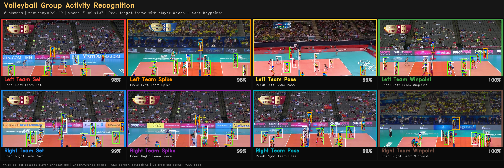
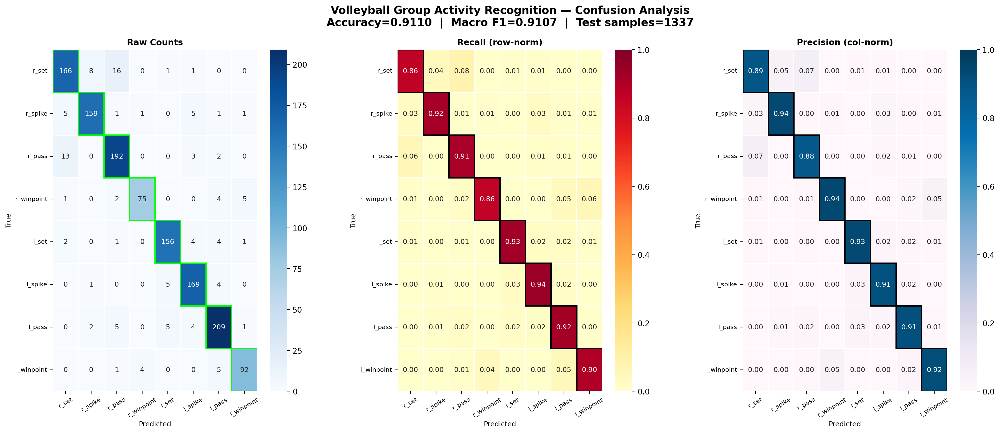
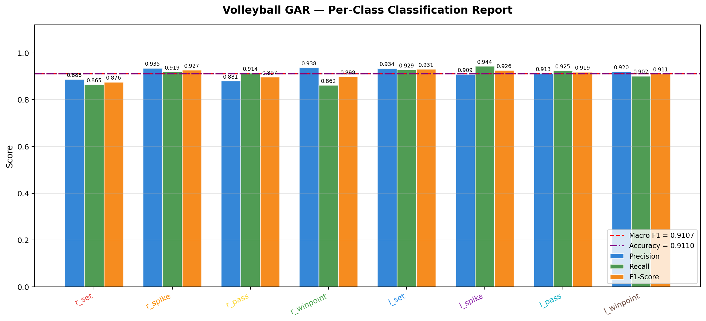
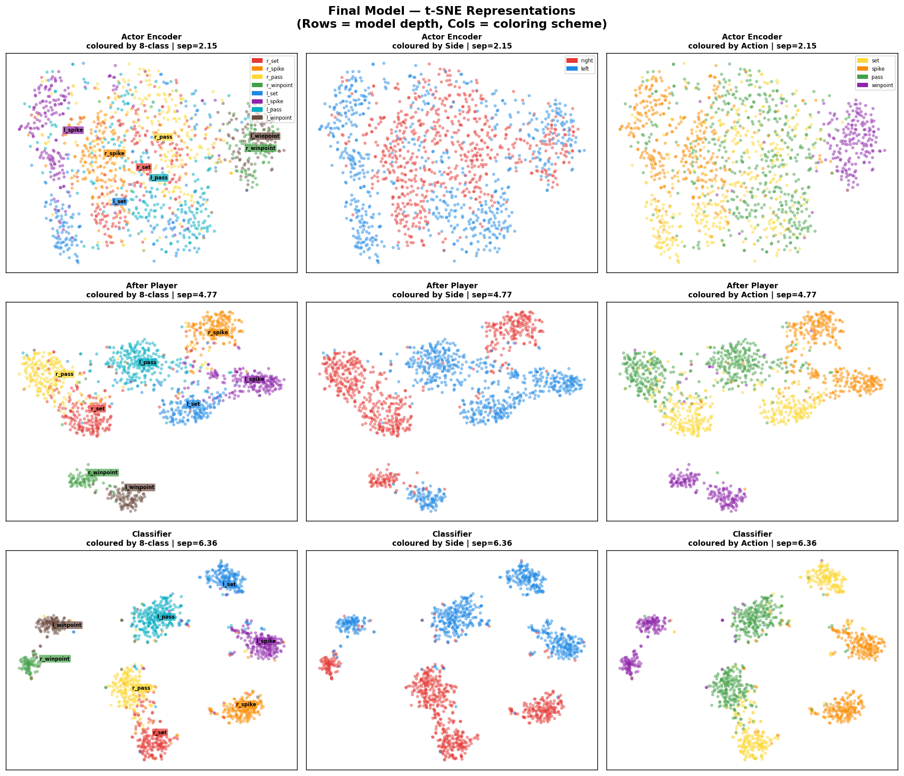
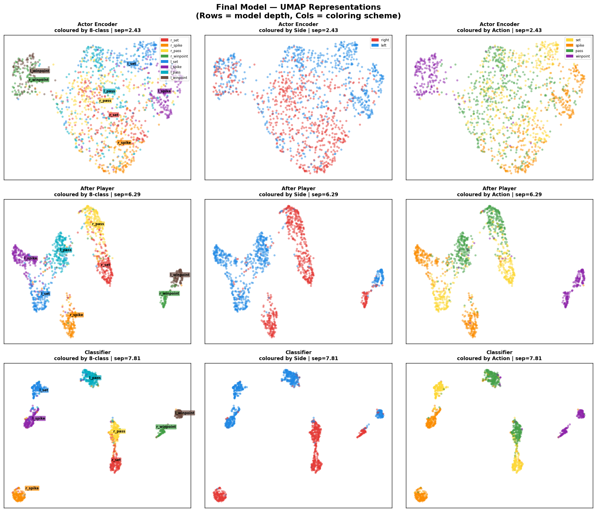
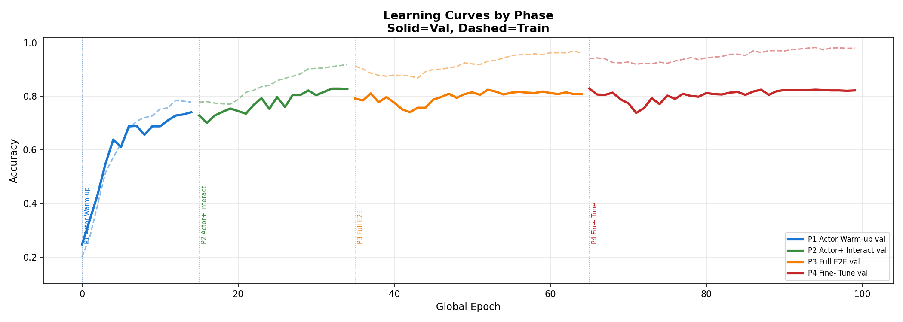
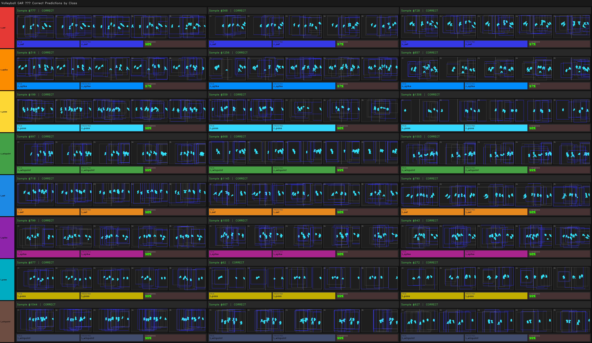

 

# Group Activity Recognition — VAT-Former

**Volleyball Actor-Team Transformer (VAT-Former)** is a lightweight yet high-accuracy deep learning model for group activity recognition on the Volleyball dataset. This architecture achieves **91.10% test accuracy** with only **883,450 parameters**, making it extremely efficient.

> Paper basis: Ibrahim et al., *"A Hierarchical Deep Temporal Model for Group Activity Recognition"*, CVPR 2016.

---

## Table of Contents

- [Overview](#overview)
- [Results](#results)
- [Architecture](#architecture)
- [Dataset](#dataset)
- [Project Structure](#project-structure)
- [Installation](#installation)
- [Training](#training)
- [Configuration](#configuration)
- [Qualitative Results](#qualitative-results)
- [Citation](#citation)
- [License](#license)

---

## Overview

Group activity recognition goes beyond single-person action recognition by jointly modeling the interactions between multiple players over time. VAT-Former addresses this with a three-stage pipeline:

1. **ActorEncoder** — Encodes per-player skeleton, motion, and context features using a Graph Convolutional Network (GCN) and learned feature branches.
2. **PlayerInteractionModule** — Models spatial player-to-player interactions and temporal dynamics using interleaved spatial and temporal Transformers with a relation-bias network.
3. **TemporalClassifier** — Performs gated fusion of the global sequence context and the target frame's representation, then classifies using a factorized head that disentangles team-side and action-type.

 

## Results

### Test Set Performance

| Metric | Value |
|---|---|
| Top-1 Accuracy | **91.10%** |
| Top-2 Accuracy | **96.86%** |
| Top-3 Accuracy | **98.58%** |
| Macro F1 | **91.07%** |

### Per-Class Classification Report

| Class | Precision | Recall | F1-Score | Support |
|---|---|---|---|---|
| r_set | 0.888 | 0.865 | 0.876 | 192 |
| r_spike | 0.935 | 0.919 | 0.927 | 173 |
| r_pass | 0.881 | 0.914 | 0.897 | 210 |
| r_winpoint | 0.938 | 0.862 | 0.898 | 87 |
| l_set | 0.934 | 0.929 | 0.931 | 168 |
| l_spike | 0.909 | 0.944 | 0.926 | 179 |
| l_pass | 0.913 | 0.925 | 0.919 | 226 |
| l_winpoint | 0.920 | 0.902 | 0.911 | 102 |
| **Macro Avg** | **0.915** | **0.907** | **0.911** | **1337** |

### Model Parameter Breakdown

| Component | Parameters |
|---|---|
| ActorEncoder | ~120K |
| PlayerInteractionModule | ~580K |
| TemporalClassifier | ~183K |
| **Total** | **883,450** |

### Comparison with State of the Art (SOTA)

| Method | Modalities | Accuracy (%) |
|---|---|---|
| HDTM (Ibrahim et al., 2016) | RGB (AlexNet/VGG) | 81.9 |
| SSRE (Bagautdinov et al., 2017)| RGB + Detection | 81.9 |
| CRM (Azar et al., 2019) | RGB (I3D) | 93.0 |
| ARG (Wu et al., 2019) | RGB + Optical Flow | 92.5 |
| AT (Gavrilyuk et al., 2020) | RGB + Optical Flow | 94.4 |
| ST-GCN (Yan et al., 2018) | Keypoints only | ~89.0 |
| **VAT-Former (Ours)** | **Keypoints + Bboxes only** | **91.1** |

*Note: Our model relies exclusively on lightweight 2D pose keypoints and bounding boxes, achieving highly competitive accuracy (91.1%) without using computationally heavy raw RGB frames, optical flow, or deep 3D-CNN features (like I3D). This makes VAT-Former exceedingly efficient (~883K params) and fast for real-time inference.*

### Confusion Matrix



### Classification Report



### Embedding Visualizations

Feature space learned by the model — t-SNE and UMAP projections show well-separated clusters for all 8 activity classes.




### Learning Curves



---

## Architecture

```
Input: Per-player pose keypoints, bounding boxes, team flags (~20 frames/clip)
         |
         v
+---------------------+
|    ActorEncoder      |    GCN over skeleton joints
|  PoseBranch (GCN)   |    + Motion MLP (velocity, acceleration, bones, angles)
|  MotionBranch (MLP) |    + Context MLP (bbox, team, zone, formation)
|  ContextBranch (MLP)|    => Actor token: (B, T, N, 128)
+---------------------+
         |
         v
+----------------------------+
|  PlayerInteractionModule   |    Relation-bias Transformer
|  RelationBiasNet           |    (spatial + temporal attention interleaved)
|  SpatialTransformer x2     |    + Learned team tokens
|  TemporalTransformer x2    |    + Key actor soft-attention
|  TeamTokens                |    => Enriched tokens + key actor + team tokens
+----------------------------+
         |
         v
+---------------------------+
|   TemporalClassifier       |
|   TemporalTransformer      |    Bidirectional over T frames
|   GatedKeyFrameFusion      |    Fuse CLS + target frame representation
|   FactorizedClassifier     |    3 heads: joint (8-class) + side (2) + action (4)
+---------------------------+
         |
         v
  Group Activity Label (8 classes)
```

### Loss Function

A multi-task focal loss is used:

```
L = L_joint + 0.5 * L_side + 0.7 * L_action
```

Where:
- `L_joint`: Focal loss with label smoothing over 8 classes
- `L_side`: Cross-entropy for left/right team side (2 classes)
- `L_action`: Cross-entropy for activity type — set/spike/pass/winpoint (4 classes)

### Training Strategy

Four progressive phases with selective component unfreezing:

| Phase | Components Unfrozen | Epochs |
|---|---|---|
| 1 — Actor Warm-up | ActorEncoder + Classifier | 15 |
| 2 — Actor + Interaction | All | 20 |
| 3 — Full End-to-End | All | 30 |
| 4 — Fine-Tune | All | 35 |

---

## Dataset

### Main Dataset: Volleyball Group Activity Recognition Dataset

**Authors:** Ibrahim et al., Simon Fraser University (CVPR 2016)

| Statistic | Value |
|---|---|
| Total Videos | 55 |
| Total Clips | 4,830 |
| Frames per Clip | 41 |
| Image Resolution | 1280 x 720 |
| Group Activity Classes | 8 |
| Player Action Classes | 9 |
| Dataset Size | 62.53 GB |

**Group Activity Classes:**

| Class | Description |
|---|---|
| l_pass | Left team passing |
| r_pass | Right team passing |
| l_set | Left team setting |
| r_set | Right team setting |
| l_spike | Left team spiking |
| r_spike | Right team spiking |
| l_winpoint | Left team wins point |
| r_winpoint | Right team wins point |

**Official Data Splits (video-level):**
- Training: 42 videos
- Validation: 13 videos
- Test: 13 videos

### Preprocessed Pose Dataset: Volleyball GAR Pose Dataset

Kaggle Path: `/kaggle/input/volleyball-pose-keypoints/`

The raw dataset was preprocessed to extract YOLO-based pose keypoints for all players across the ~20 annotated frames per clip. Each clip is stored as a `.pkl` file with the following structure:

```python
{
    'video_id':       str,           # "0" to "54"
    'clip_id':        str,           # Target frame ID (e.g., "13286")
    'group_activity': str,           # Group activity label
    'target_frame':   str,           # Middle frame (= clip_id)
    'num_frames':     int,           # ~20 annotated frames
    'frame_ids':      List[str],     # Sorted list of ~20 frame IDs
    'players': {
        player_id (int): {
            'team':           int,              # 0=Left, 1=Right
            'action':         str,              # Player action at target frame
            'keypoints':      np.float32 (T, 17, 3),
            'bboxes':         np.float32 (T, 4),
            'bbox_conf':      np.float32 (T,),
            'kp_success':     np.bool    (T,),
            'valid_kp_count': np.int32   (T,)
        }
    }
}
```

**Frame Selection:** Each clip uses ~20 annotated frames. The **target frame** is the middle frame and is always included in sampling. 10 frames are sampled per clip, centered on the target frame, with the target frame position tracked (`key_frame_pos`) for gated fusion in the classifier.

**Feature Engineering (232-dimensional per player per frame):**

| Feature Group | Dim | Description |
|---|---|---|
| kp_global | 51 | Raw 17-joint keypoints (x, y, conf) |
| kp_relative | 34 | Person-normalized keypoint coordinates |
| velocity | 34 | Joint velocity (frame difference) |
| acceleration | 34 | Joint acceleration |
| bones | 32 | Bone vector lengths |
| angles | 19 | Joint angle triplets |
| bbox | 4 | Bounding box (cx, cy, w, h) |
| bbox_vel | 4 | Bounding box velocity |
| zone | 6 | Court zone one-hot (2x3 grid) |
| team | 2 | Team one-hot |
| net_signed | 1 | Signed distance to net |
| net_abs | 1 | Absolute distance to net |
| jump_proxy | 3 | Jump/spike proxy features |
| formation | 6 | Team formation descriptors |
| present | 1 | Validity mask |
| **Total** | **232** | |

**Data Augmentation (training only):**
- Horizontal flip (with symmetric label mapping)
- Keypoint Gaussian jitter
- Random player dropout (0-2 players)

---

## Project Structure

```
Group_Activity_Recognition_V2/
|
+-- vgar/                          # Core library package
|   +-- __init__.py
|   +-- configs/
|   |   +-- __init__.py
|   |   +-- default.py             # Default hyperparameter configuration
|   +-- data/
|   |   +-- __init__.py
|   |   +-- features.py            # Constants, vocabulary, feature layout
|   |   +-- dataset.py             # Dataset class, feature extraction, data loaders
|   +-- models/
|   |   +-- __init__.py
|   |   +-- actor_encoder.py       # Skeleton GCN + Motion + Context branches
|   |   +-- relation_transformer.py # Spatial/temporal attention with relation bias
|   |   +-- temporal_classifier.py # Temporal transformer + factorized classifier
|   |   +-- pipeline.py            # VATFormer end-to-end pipeline
|   +-- training/
|       +-- __init__.py
|       +-- losses.py              # Focal loss + multi-task loss
|
+-- train.py                       # Main training script (4-phase curriculum)
+-- requirements.txt
+-- LICENSE
+-- .gitignore
+-- README.md
|
+-- assets/
    +-- results/                   # Evaluation outputs
    |   +-- classification_report.txt
    |   +-- classification_report.json
    |   +-- topk_accuracy.json
    |   +-- classification_report.png
    |   +-- confusion_combined.png
    |   +-- confusion_raw.png
    |   +-- confusion_precision.png
    |   +-- confusion_recall.png
    |   +-- confidence_per_class.png
    |   +-- final_deep_tsne.png
    |   +-- final_deep_umap.png
    |   +-- final_hidden_density_tsne.png
    |   +-- final_hidden_density_umap.png
    |   +-- phase_evolution_tsne.png
    |   +-- phase_evolution_umap.png
    |   +-- probability_space_tsne.png
    |   +-- probability_space_umap.png
    |   +-- separation_evolution_tsne.png
    |   +-- separation_evolution_umap.png
    |   +-- raw_feature_space.png
    |   +-- model_parameters.png
    +-- training/                  # Training diagnostics
    |   +-- learning_curves.png
    |   +-- class_distribution.png
    +-- qualitative/               # Per-class top-ranked predictions
    |   +-- gallery_all_classes.png
    |   +-- l_pass_rank1.png  ...  r_winpoint_rank3.png
    +-- videos/                    # Sample prediction videos
        +-- l_set.mp4
        +-- l_spike.mp4
        +-- r_pass.mp4
        +-- r_spike.mp4
        +-- r_winpoint.mp4
```

---

## Installation

```bash
git clone https://github.com/Bavleyhesham8/Group_Activity_Recognition_V2.git
cd Group_Activity_Recognition_V2
pip install -r requirements.txt
```

**Requirements:**
- Python 3.9+
- PyTorch 2.0+
- CUDA-capable GPU (recommended: V100 / A100 for training)

---

## Training

### 1. Prepare the Dataset

Download the preprocessed pose keypoint dataset from Kaggle:

```
/kaggle/input/volleyball-pose-keypoints/
```

Update the paths in `vgar/data/features.py`:

```python
DATA_ROOT = Path("/your/path/to/volleyball_pose_data")
KP_DIR    = DATA_ROOT / "keypoints"
META_DIR  = DATA_ROOT / "metadata"
```

### 2. Run Training

```bash
python train.py
```

This will run the 4-phase curriculum training and save the best model to:

```
/kaggle/working/vgar/models/final_model.pt
```

### 3. Monitor Progress

Training logs print per-epoch metrics:

```
Ep  1 | TrAcc:0.312 | ValAcc:0.421 | ValF1:0.397 | Ltot:2.1234 | ...
```

---

## Configuration

All hyperparameters are in `vgar/configs/default.py`:

```python
DEFAULT_CONFIG = {
    "batch_size":        32,
    "dropout_rate":      0.15,
    "n_heads":           4,
    "n_temporal_layers": 3,

    # Loss weights
    "focal_gamma":       2.0,
    "label_smoothing":   0.05,
    "w_side":            0.5,
    "w_action":          0.7,

    # Optimizer
    "lr":                3e-4,
    "lr_min":            1e-6,
    "weight_decay":      0.05,
    "grad_clip":         1.0,
    "warmup_epochs":     5,

    # Training phases
    "phase1_epochs":     15,
    "phase2_epochs":     20,
    "phase3_epochs":     30,
    "phase4_epochs":     35,
}
```

---

## Qualitative Results

### Sample Predictions by Class



### Sample Prediction Videos

The following videos show the model's predictions on held-out test clips with skeleton overlays and activity labels:

| Activity | Video |
|---|---|
| Left Set | `assets/videos/l_set.mp4` |
| Left Spike | `assets/videos/l_spike.mp4` |
| Right Pass | `assets/videos/r_pass.mp4` |
| Right Spike | `assets/videos/r_spike.mp4` |
| Right Winpoint | `assets/videos/r_winpoint.mp4` |

---

## Citation

If you use this code or the Volleyball dataset in your research, please cite the original dataset paper:

```bibtex
@inproceedings{ibrahim2016hierarchical,
  title     = {A Hierarchical Deep Temporal Model for Group Activity Recognition},
  author    = {Ibrahim, Mostafa S and Muralidharan, Srikanth and Deng, Zhiwei and Vahdat, Arash and Mori, Greg},
  booktitle = {Proceedings of the IEEE Conference on Computer Vision and Pattern Recognition},
  pages     = {1971--1980},
  year      = {2016}
}
```

---

## License

This project is released under the MIT License. See [LICENSE](LICENSE) for details.

The Volleyball dataset is the property of Simon Fraser University. Please refer to the original authors for dataset licensing and usage terms.

---

## Acknowledgments

- Dataset: Ibrahim et al. (CVPR 2016) — Simon Fraser University
- Pose estimation: [Ultralytics YOLOv8-Pose](https://github.com/ultralytics/ultralytics)
